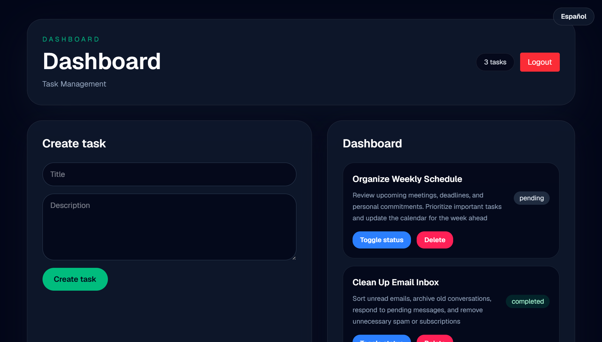
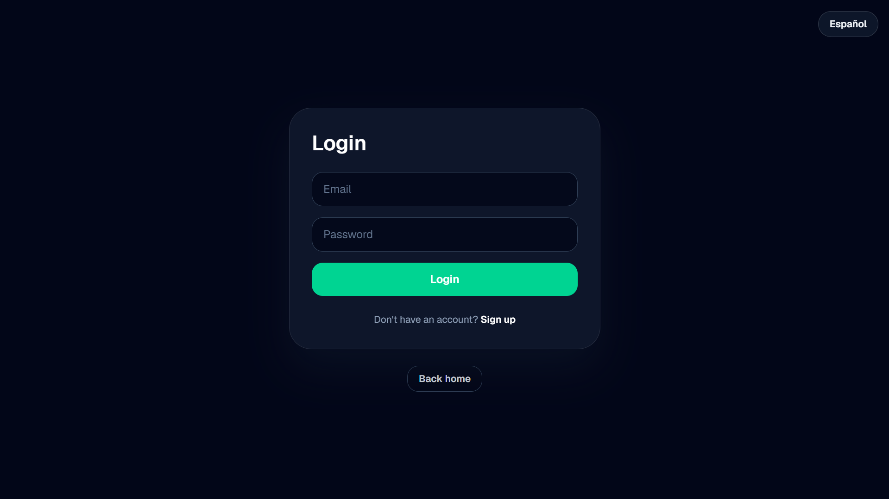
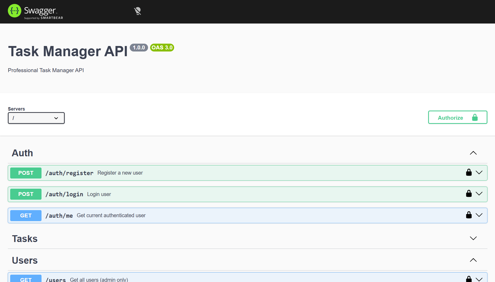

# Task Manager API


🇺🇸 English version  
🇪🇸 [Versión en Español](./README.es.md)

Professional REST API for task management built with Node.js, Express, Prisma, PostgreSQL and JWT authentication.

## 🚀 Live Demo

Frontend:
https://task-manager-frontend-eight-lime.vercel.app

API:
https://task-manager-api-o1ko.onrender.com

Swagger Docs:
https://task-manager-api-o1ko.onrender.com/api-docs

---

## 📸 Preview



---

# ✨ Features

- JWT Authentication
- Role Based Access Control (RBAC)
- CRUD Operations
- Soft Delete
- Pagination
- Filtering
- Global Error Handling
- Input Validation with Zod
- Swagger Documentation
- Prisma ORM
- PostgreSQL Database
- Frontend Integration

---

# 🛠️ Tech Stack

- Node.js
- Express.js
- PostgreSQL
- Prisma ORM
- JWT
- Zod
- Swagger
- Supabase
- Render

---

# 📂 Project Structure

src/
│
├── controllers/
├── services/
├── repositories/
├── middlewares/
├── routes/
├── utils/
├── config/
├── schemas/
│
├── app.js
└── server.js

---

# 🔐 Authentication

The API uses JWT Bearer Authentication.

Example:

Authorization: Bearer YOUR_TOKEN



---

# 📘 API Endpoints

## Auth

| Method | Endpoint | Description |
|---|---|---|
| POST | /auth/register | Register user |
| POST | /auth/login | Login user |
| GET | /auth/me | Get current user |

---

## Tasks

| Method | Endpoint | Description |
|---|---|---|
| GET | /tasks | Get user tasks |
| POST | /tasks | Create task |
| PUT | /tasks/:id | Update task |
| DELETE | /tasks/:id | Soft delete task |

---

## Users (Admin Only)

| Method | Endpoint | Description |
|---|---|---|
| GET | /users | Get all users |

---

# ⚙️ Environment Variables

Create a `.env` file:

```env
DATABASE_URL=your_database_url
JWT_SECRET=your_secret
```

---

# 📦 Installation

Clone repository:

```bash
git clone https://github.com/Matiabou/task-manager-api.git
```

Install dependencies:

```bash
npm install
```

Run development server:

```bash
npm run dev
```

---

# 🧪 Swagger Documentation

Swagger UI available at:

```txt
/api-docs
```



---

# 🧠 Architecture

This project follows a layered architecture:

- Routes → API endpoints
- Controllers → Request/response handling
- Services → Business logic
- Repositories → Database access

---

# 👤 Roles

Two roles are supported:

- user
- admin

---

# 🔥 Advanced Features

## Soft Delete

Tasks are not physically deleted from the database.

## Pagination

Example:

```http
GET /tasks?page=1&limit=10
```

## Filtering

Example:

```http
GET /tasks?status=completed
```

---

# 📄 License

MIT
